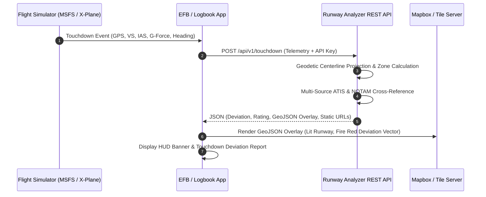

# 📡 ICAO Runway Analyzer — REST API & Map Integration Reference

High-precision runway touchdown telemetry, certified geodetic runway data, multi-source weather/ATIS, unified visual styling tokens, and Mapbox static image generation API for third-party flight simulator tools, mobile EFBs, and logbook apps.

---

## 📑 Table of Contents
1. [Authentication](#-authentication)
2. [Visual Styling & Overlay Continuation](#-visual-styling--overlay-continuation)
   - [Unified Map Styling Tokens (`map_styling`)](#1-unified-map-styling-tokens-map_styling)
   - [Target Dot Visual Hierarchy (Runway vs Closed vs Taxiway vs Off-Airfield)](#2-target-dot-visual-hierarchy)
   - [GeoJSON FeatureCollection Overlay (`geojson_overlay`)](#3-geojson-featurecollection-overlay-geojson_overlay)
   - [Mapbox High-Res Static Snapshots](#4-mapbox-high-res-static-snapshots)
   - [Accessing & Parsing Style Tokens in Client Apps](#5-accessing--parsing-style-tokens-in-client-apps)
   - [How to Request Runway Polygon & Centerline](#6-how-to-request-runway-polygon--centerline)
3. [Field & Metric Query Filtering](#-field--metric-query-filtering)
4. [Endpoints Directory](#-endpoints-directory)
5. [Endpoints Reference](#-endpoints-reference)
   - [POST /api/v1/touchdown (Core Landing Telemetry & GeoJSON)](#1-analyze-touchdown-telemetry-post-apiv1touchdown)
   - [GET /api/v1/map/static (Mapbox Static Map Images)](#2-mapbox-static-landing-map-images-get-apiv1mapstatic)
   - [GET /api/v1/airport/:icao (Airport Metadata)](#3-get-airport-info-get-apiv1airporticao)
   - [GET /api/v1/airport/:icao/runways (Calibrated Runways Array)](#4-get-airport-runways-get-apiv1airporticaorunways)
   - [GET /api/v1/airports/search (Airport Database Search)](#5-search-airports-get-apiv1airportssearch)
   - [GET /api/v1/airport/:icao/weather (Live METAR & ATIS)](#6-get-airport-weather--atis-get-apiv1airporticaoweather)
   - [GET /api/v1/airport/:icao/notams (Active NOTAMs)](#7-get-airport-notams-get-apiv1airporticaonotams)
6. [Code Implementation Examples](#-code-implementation-examples)
   - [cURL](#1-curl-examples)
   - [JavaScript / TypeScript (Mapbox GL & Leaflet Integration)](#2-javascript--typescript-browser--nodejs)
   - [Python (Requests & Image Downloader)](#3-python-requests--image-downloader)
   - [Swift / iOS (URLSession & MapKit)](#4-swift--ios-urlsession--mapkit)
   - [C# / .NET (HttpClient & Strong Types)](#5-c--net-httpclient)

---

## 🎨 Visual Styling & Overlay Continuation

To ensure **100% visual continuation** across web apps, mobile apps (iOS/Android), desktop flight sim plugins, and static image snapshots, the API returns complete, standard GeoJSON styling attributes and a structured design token object (`map_styling`).

### 1. Unified Map Styling Tokens (`map_styling`)

| Visual Element | Status / Condition | Hex Color | Opacity & Width | Description |
|---|---|---|---|---|
| **Active Landing Runway** | `active_lit_landing` | 🟢 `#00ff88` (Emerald) | Fill: `0.18`, Stroke: `2.5px` | Lit-up active landing runway polygon. |
| **Closed Runway** | `closed` | 🔴 `#ff4757` (Crimson) | Fill: `0.35`, Stroke: `3.5px` | Warning highlight over closed runway. |
| **Nearby Runway** | `near_runway` | 🔵 `#00d4ff` (Cyan) | Fill: `0.14`, Stroke: `1.5px` | Nearby or selected unactive runway outline. |
| **Runway Centerline** | All | ⚪ `#ffffff` (White) | Stroke: `2.0px`, Dash: `8,6` | Surveyed geodetic runway centerline. |
| **Deviation Line** | Cross-track deviation | 🔴 `#ff1e42` (Fire Red) | Stroke: `3.5px`, Dash: `5,5` | Perpendicular cross-track deviation vector. |
| **Centerline Dot** | Perpendicular projection | 🟢 `#00ff88` (Ring) + ⚪ `#ffffff` | Fill: `1.0`, Radius: `3.5m` | Intersection point on the runway centerline. |
| **HUD Banner** | Floating Map Overlay | ⬛ `rgba(15,23,42,0.96)` | Border: `1.5px` `#ff1e42` | Multi-line telemetry HUD box with blur. |

---

### 2. Target Dot Visual Hierarchy

The touchdown target coordinate is rendered with a 3-layer reticle to ensure maximum visibility on satellite imagery:

```
    Layer 1: Outer Glowing Halo   (Radius: 10.5m, 35% Opacity, Color-coded)
      Layer 2: Main Target Ring   (Radius: 6.5m, White 2px Border, 100% Fill)
        Layer 3: Pinpoint Core    (Radius: 2.0m, Crisp White Solid Core)
```

| Touchdown Condition | Dot Color (`fill`) | Type Identifier | Description |
|---|---|---|---|
| **On Runway** | 🔴 `#ff1e42` (Fire Red) | `on_runway` | Standard on-runway landing reticle. |
| **Closed Runway** | 🛑 `#dc2626` (Deep Crimson) | `closed_runway` | Landing on a NOTAM-closed runway surface. |
| **Taxiway** | 🟡 `#ffb800` (Amber Gold) | `taxiway` | Position located on taxiway pavement. |
| **Off Airfield** | 🟠 `#f97316` (Fire Orange) | `off_airfield` | Touchdown outside airfield perimeter. |

---

### 3. GeoJSON FeatureCollection Overlay (`geojson_overlay`)

The `geojson_overlay` returned by `POST /api/v1/touchdown` and `POST /api/analyze` is a 100% spec-compliant GeoJSON object with standard simple-style properties (`stroke`, `stroke-width`, `stroke-opacity`, `fill`, `fill-opacity`, `element-type`).

You can pass `geojson_overlay` directly into `map.addSource('runway-overlay', { type: 'geojson', data: response.geojson_overlay })` in **Mapbox GL JS**, `L.geoJSON(response.geojson_overlay)` in **Leaflet**, or Google Maps GeoJSON layer!

---

### 4. Mapbox High-Res Static Snapshots

The API generates static map snapshot URLs with the entire styled runway geometry, white centerline, Fire Red deviation line, and target reticle embedded directly:

- `satellite_url`: Maxar 50cm satellite imagery at calibrated zoom level.
- `runway_perspective_url`: Oriented along runway approach heading (`bearing: heading`, `pitch: 25°`).
- `dark_mode_url`: High-contrast dark vector map.
- `direct_image_api`: Binary endpoint `GET /api/v1/map/static` that streams PNG bytes directly.

---

### 5. Accessing & Parsing Style Tokens in Client Apps

All styling tokens are delivered in **two places** in the `POST /api/v1/touchdown` response:

1. **Root-Level Design Tokens (`response.map_styling`)**:
   Direct access to the exact color tokens, stroke widths, opacities, and dash arrays:
   ```javascript
   // JavaScript / TypeScript Access Example:
   const runwayFill = data.map_styling.runway_overlay.fill;          // e.g. "#00ff88"
   const runwayOpacity = data.map_styling.runway_overlay.fill_opacity; // e.g. 0.18
   const centerlineColor = data.map_styling.centerline.stroke;        // "#ffffff"
   const deviationLine = data.map_styling.centerline_deviation_vector.stroke; // "#ff1e42"
   const targetDotFill = data.map_styling.touchdown_dot.fill;        // "#ff1e42"
   ```

2. **Per-Feature GeoJSON Properties (`response.geojson_overlay.features[i].properties`)**:
   Standard simple-style attributes embedded directly in each GeoJSON feature:
   ```javascript
   // Leaflet or Mapbox GL Feature Styling:
   L.geoJSON(data.geojson_overlay, {
     style: (feature) => ({
       color: feature.properties.stroke,
       weight: feature.properties['stroke-width'],
       fillColor: feature.properties.fill,
       fillOpacity: feature.properties['fill-opacity']
     })
   }).addTo(map);
   ```

> [!IMPORTANT]
> **Common Gotcha — Root Key vs Nested**:
> `map_styling` is located at the **root** of the API response (`response.map_styling`), **NOT** inside `response.touchdown.map_styling`.
> 
> If your application is using field filtering (e.g. `?fields=touchdown`), the server will omit `map_styling` unless you explicitly include it: `?fields=touchdown,map_styling,geojson_overlay`.

---

### 6. How to Request Runway Polygon & Centerline

You can obtain runway polygons and centerlines via two workflows:

#### Workflow A: Pre-Calculated GeoJSON FeatureCollection (Dynamic Landing)
Calling `POST /api/v1/touchdown` automatically computes the exact 4-corner runway polygon and centerline geometry:

```bash
curl -X POST https://maps.simtechtracker.com/api/v1/touchdown \
  -H "Content-Type: application/json" \
  -H "X-API-Key: YOUR_API_KEY" \
  -d '{ "lat": 40.77665, "lon": -73.87185, "heading": 212 }'
```

**Response (`geojson_overlay.features`)**:
- **Runway Polygon (`element-type: "runway-overlay"`)**: 4-corner bounding rectangle oriented with runway heading.
- **Centerline (`element-type: "runway-centerline"`)**: True geodetic LineString from landing threshold to opposite end.
- **Deviation Vector (`element-type: "deviation-vector"`)**: Perpendicular cross-track offset line.

**Mapbox GL JS Implementation**:
```javascript
map.addSource('runway-source', { type: 'geojson', data: data.geojson_overlay });

// Add Runway Polygon Layer
map.addLayer({
  id: 'rwy-poly',
  type: 'fill',
  source: 'runway-source',
  filter: ['==', 'element-type', 'runway-overlay'],
  paint: { 'fill-color': ['get', 'fill'], 'fill-opacity': ['get', 'fill-opacity'] }
});

// Add Centerline Layer
map.addLayer({
  id: 'rwy-line',
  type: 'line',
  source: 'runway-source',
  filter: ['==', 'element-type', 'runway-centerline'],
  paint: { 'line-color': ['get', 'stroke'], 'line-width': ['get', 'stroke-width'] }
});
```

#### Workflow B: Raw Threshold Endpoints (Airport Lookup)
To get runway dimensions and threshold coordinates without a touchdown analysis:

```bash
curl -X GET https://maps.simtechtracker.com/api/v1/airport/KLGA/runways \
  -H "X-API-Key: YOUR_API_KEY"
```

**Response**:
```json
{
  "icao": "KLGA",
  "runways": [
    {
      "le_ident": "04",
      "he_ident": "22",
      "length_ft": 7002,
      "width_ft": 150,
      "le_latitude_deg": 40.769168,
      "le_longitude_deg": -73.884123,
      "he_latitude_deg": 40.785440,
      "he_longitude_deg": -73.870681
    }
  ]
}
```

*Centerline = Line from `[le_latitude_deg, le_longitude_deg]` to `[he_latitude_deg, he_longitude_deg]`.*

*4-Corner Polygon = Extrude centerline perpendicular by `(width_ft * 0.3048) / 2`.*

---

## 🔍 Field & Metric Query Filtering

Clients can request tailored JSON payloads to reduce bandwidth and parse only the data required:

| Parameter | Location | Type | Example | Description |
|---|---|---|---|---|
| `fields` | Query or Body | `string\|array` | `fields=touchdown,map_styling,static_map` | Filter top-level JSON keys returned. |
| `metrics` | Query or Body | `string\|array` | `metrics=dev,fpm,g,wind,speed` | Filter specific telemetry keys in `touchdown`. |
| `banner_fields` | Query or Body | `string\|array` | `banner_fields=dev,fpm,g,speed,wind` | Select which rows appear in the pre-rendered HUD banner. |
| `banner_options` | Body | `object` | `{"omit": ["wind"]}` | Advanced HUD banner formatting options. |

---

## 🔑 Authentication

All `/api/v1/*` endpoints require an API Key passed in the `X-API-Key` HTTP header:

```http
X-API-Key: rwy_your_api_key_here
```

---

## 📡 Endpoints Directory

| Method | Endpoint | Description |
|---|---|---|
| `POST` | `/api/v1/touchdown` | **Core Landing Telemetry:** Evaluates touchdown coordinates, centerline deviation, threshold distance, touchdown zone, winds, rating, GeoJSON overlay, and static map links. |
| `GET` | `/api/v1/map/static` | **Mapbox Static Images:** Streams binary PNG snapshot or returns JSON URL with embedded GeoJSON overlay. |
| `GET` | `/api/v1/airport/:icao` | Get full airport metadata, elevation, coordinates, and classification. |
| `GET` | `/api/v1/airport/:icao/runways` | Get all calibrated runways with true headings, lengths, widths, and surfaces. |
| `GET` | `/api/v1/airports/search?q=` | Instant search across 85,917 airports by ICAO, IATA, name, or city. |
| `GET` | `/api/v1/airport/:icao/weather` | Live operational weather suite: FAA D-ATIS, VATSIM ATIS, IVAO ATIS, and NOAA METAR. |
| `GET` | `/api/v1/airport/:icao/notams` | Active airport NOTAMs and closed runway designator alerts. |

---

## 📖 Endpoints Reference

### 1. Analyze Touchdown Telemetry (`POST /api/v1/touchdown`)

#### Request Headers
```http
Content-Type: application/json
X-API-Key: rwy_your_api_key_here
```

#### Request Body (JSON)
```json
{
  "lat": 40.77665,
  "lon": -73.87185,
  "heading": 212,
  "vertical_speed_fpm": -135,
  "ias_kt": 132,
  "g_force": 1.14,
  "bank_deg": 1.2,
  "pitch_deg": 4.5,
  "icao": "KLGA",
  "banner_fields": ["dev", "fpm", "g", "speed", "wind"]
}
```

#### Response (On-Runway Touchdown - JSON)
```json
{
  "status": "on_runway",
  "touchdown_coordinates": {
    "latitude": 40.77665,
    "longitude": -73.87185
  },
  "airport": {
    "icao": "KLGA",
    "iata": "LGA",
    "name": "LaGuardia Airport",
    "city": "New York",
    "country": "US",
    "elevation_ft": 21
  },
  "touchdown": {
    "on_runway": true,
    "runway_ident": "22",
    "runway_pair": "04/22",
    "runway_heading_deg": 212,
    "surface": "asphalt",
    "length_ft": 7002,
    "width_ft": 150,
    "centerline_deviation": {
      "deviation_ft": -12.4,
      "deviation_m": -3.78,
      "side": "left",
      "text": "12.4 ft left"
    },
    "threshold_distance": {
      "distance_from_threshold_ft": 1450.2,
      "distance_from_threshold_m": 442.0,
      "touchdown_zone": "TDZ",
      "remaining_runway_ft": 5551.8,
      "remaining_runway_m": 1692.2,
      "percent_runway_used": 20.7
    },
    "wind": {
      "headwind_kt": 8.2,
      "crosswind_kt": -3.1,
      "summary": "Headwind 8.2kt, 3.1kt from left"
    },
    "flight_telemetry": {
      "aircraft_heading_deg": 212,
      "vertical_speed_fpm": -135,
      "ias_kt": 132,
      "g_force": 1.14,
      "landing_rating": "✨ Good Landing"
    },
    "banner_html": "<div class=\"touchdown-deviation-banner\" ...>...</div>",
    "banner_data": {
      "deviation_ft": -12.4,
      "side": "left",
      "vertical_speed_fpm": -135,
      "g_force": 1.14,
      "ias_kt": 132,
      "heading_deg": 212,
      "wind_dir": 60,
      "wind_speed": 11
    }
  },
  "map_styling": {
    "runway_overlay": {
      "status": "active_lit_landing",
      "stroke": "#00ff88",
      "stroke_width": 2.5,
      "fill": "#00ff88",
      "fill_opacity": 0.18
    },
    "centerline": {
      "stroke": "#ffffff",
      "stroke_width": 2.0,
      "stroke_opacity": 0.95,
      "dash_array": "8,6"
    },
    "centerline_deviation_vector": {
      "stroke": "#ff1e42",
      "stroke_width": 3.5,
      "stroke_opacity": 1.0,
      "dash_array": "5,5"
    },
    "centerline_intersection_dot": {
      "stroke": "#ffffff",
      "stroke_width": 1.5,
      "fill": "#00ff88",
      "fill_opacity": 1.0,
      "radius_m": 3.5
    },
    "touchdown_dot": {
      "type": "on_runway",
      "label": "Touchdown Target (Fire Red)",
      "fill": "#ff1e42",
      "stroke": "#ffffff",
      "stroke_width": 2.0,
      "halo_fill": "#ff1e42",
      "halo_opacity": 0.35,
      "halo_radius_m": 10.5,
      "core_fill": "#ffffff",
      "core_radius_m": 2.0
    }
  },
  "static_map": {
    "satellite_url": "https://api.mapbox.com/styles/v1/mapbox/satellite-v9/static/geojson(...)/-73.87185,40.77665,16,0,0/800x500@2x?access_token=...",
    "runway_perspective_url": "https://api.mapbox.com/styles/v1/mapbox/satellite-v9/static/geojson(...)/-73.87185,40.77665,16,212,25/800x500@2x?access_token=...",
    "dark_mode_url": "https://api.mapbox.com/styles/v1/mapbox/dark-v11/static/geojson(...)/-73.87185,40.77665,16,0,0/800x500@2x?access_token=...",
    "direct_image_api": "/api/v1/map/static?lat=40.77665&lon=-73.87185&zoom=16&style=satellite"
  },
  "geojson_overlay": {
    "type": "FeatureCollection",
    "features": [
      {
        "type": "Feature",
        "properties": {
          "name": "Runway 04/22 (Active Lit Landing)",
          "stroke": "#00ff88",
          "stroke-width": 2.5,
          "fill": "#00ff88",
          "fill-opacity": 0.18,
          "element-type": "runway-overlay"
        },
        "geometry": { "type": "Polygon", "coordinates": [] }
      },
      {
        "type": "Feature",
        "properties": {
          "name": "Centerline",
          "stroke": "#ffffff",
          "stroke-width": 2,
          "stroke-opacity": 0.95,
          "element-type": "runway-centerline"
        },
        "geometry": { "type": "LineString", "coordinates": [] }
      },
      {
        "type": "Feature",
        "properties": {
          "name": "Centerline Deviation Vector",
          "stroke": "#ff1e42",
          "stroke-width": 3.5,
          "deviation_ft": -12.4,
          "side": "left",
          "element-type": "deviation-vector"
        },
        "geometry": { "type": "LineString", "coordinates": [] }
      },
      {
        "type": "Feature",
        "properties": {
          "name": "Centerline Intersection",
          "stroke": "#ffffff",
          "stroke-width": 1.5,
          "fill": "#00ff88",
          "fill-opacity": 1.0,
          "element-type": "centerline-dot"
        },
        "geometry": { "type": "Polygon", "coordinates": [] }
      },
      {
        "type": "Feature",
        "properties": {
          "name": "Touchdown Point - Halo",
          "stroke": "#ff1e42",
          "fill": "#ff1e42",
          "fill-opacity": 0.35,
          "element-type": "touchdown-halo"
        },
        "geometry": { "type": "Polygon", "coordinates": [] }
      },
      {
        "type": "Feature",
        "properties": {
          "name": "Touchdown Point (Fire Red)",
          "stroke": "#ffffff",
          "stroke-width": 2,
          "fill": "#ff1e42",
          "fill-opacity": 1.0,
          "element-type": "touchdown-target-dot"
        },
        "geometry": { "type": "Polygon", "coordinates": [] }
      },
      {
        "type": "Feature",
        "properties": {
          "name": "Touchdown Pinpoint Core",
          "stroke": "#0f172a",
          "stroke-width": 0.8,
          "fill": "#ffffff",
          "fill-opacity": 1.0,
          "element-type": "touchdown-core"
        },
        "geometry": { "type": "Polygon", "coordinates": [] }
      }
    ]
  }
}
```

---

### 2. Mapbox Static Landing Map Images (`GET /api/v1/map/static`)

Generates a standalone satellite image with embedded lit-up runway overlay, white centerline, red deviation vector, and touchdown reticle.

```http
GET /api/v1/map/static?lat=40.77665&lon=-73.87185&zoom=16&bearing=212&pitch=25
X-API-Key: rwy_your_api_key_here
```

| Query Param | Default | Description |
|---|---|---|
| `lat` | *Required* | Touchdown latitude. |
| `lon` | *Required* | Touchdown longitude. |
| `zoom` | `16` | Zoom level (`1` to `20`). `16` is calibrated for runway scale. |
| `width` | `800` | Image pixel width (`100` to `1280`). |
| `height` | `500` | Image pixel height (`100` to `1280`). |
| `bearing` | `0` | Camera rotation heading (0–360°). |
| `pitch` | `0` | Camera 3D tilt (0–60°). |
| `style` | `satellite-v9` | Base style: `satellite-v9`, `dark-v11`, `streets-v12`, `outdoors-v12`. |
| `format` | `image` | `image` (streams PNG bytes), `json` (returns image URL payload), or `redirect`. |

---

### 3. Get Airport Info (`GET /api/v1/airport/:icao`)

Retrieve comprehensive metadata for an airport by its 4-letter ICAO code.

#### Request Headers
```http
X-API-Key: rwy_your_api_key_here
```

#### Example Request
```http
GET /api/v1/airport/KJFK
```

#### Response (JSON)
```json
{
  "icao": "KJFK",
  "iata": "JFK",
  "name": "John F Kennedy International Airport",
  "city": "New York",
  "country": "US",
  "latitude": 40.639801,
  "longitude": -73.7789,
  "elevation_ft": 13,
  "timezone": "America/New_York",
  "type": "large_airport"
}
```

---

### 4. Get Airport Runways (`GET /api/v1/airport/:icao/runways`)

Retrieve all calibrated runways for an airport, including accurate threshold coordinates, magnetic/true headings, dimensions, and surface types.

#### Request Headers
```http
X-API-Key: rwy_your_api_key_here
```

#### Example Request
```http
GET /api/v1/airport/KLGA/runways
```

#### Response (JSON)
```json
{
  "icao": "KLGA",
  "runway_count": 2,
  "runways": [
    {
      "le_ident": "04",
      "he_ident": "22",
      "length_ft": 7002,
      "width_ft": 150,
      "surface": "asphalt",
      "le_heading_degT": 32.4,
      "he_heading_degT": 212.4,
      "le_latitude_deg": 40.7681,
      "le_longitude_deg": -73.8789,
      "he_latitude_deg": 40.7845,
      "he_longitude_deg": -73.8647,
      "is_closed": false,
      "lighted": true
    },
    {
      "le_ident": "13",
      "he_ident": "31",
      "length_ft": 7000,
      "width_ft": 150,
      "surface": "asphalt",
      "le_heading_degT": 122.1,
      "he_heading_degT": 302.1,
      "le_latitude_deg": 40.7812,
      "le_longitude_deg": -73.8828,
      "he_latitude_deg": 40.7714,
      "he_longitude_deg": -73.8608,
      "is_closed": false,
      "lighted": true
    }
  ]
}
```

---

### 5. Search Airports (`GET /api/v1/airports/search`)

Instant search across 85,000+ airports worldwide by ICAO code, IATA code, airport name, or city.

#### Request Headers
```http
X-API-Key: rwy_your_api_key_here
```

#### Query Parameters
| Parameter | Type | Required | Description |
|---|---|---|---|
| `q` | `string` | **Yes** | Search keyword (e.g., `LGA`, `London`, `Heathrow`, `EGLL`). |

#### Example Request
```http
GET /api/v1/airports/search?q=Heathrow
```

#### Response (JSON)
```json
[
  {
    "icao": "EGLL",
    "iata": "LHR",
    "name": "London Heathrow Airport",
    "city": "London",
    "country": "GB",
    "latitude": 51.4706,
    "longitude": -0.461941,
    "elevation_ft": 83
  }
]
```

---

### 6. Get Airport Weather & ATIS (`GET /api/v1/airport/:icao/weather`)

Retrieve the unified multi-source operational weather report, merging Real-World FAA D-ATIS, VATSIM Network ATIS, IVAO Network ATIS, and NOAA METAR observations.

#### Request Headers
```http
X-API-Key: rwy_your_api_key_here
```

#### Example Request
```http
GET /api/v1/airport/KJFK/weather
```

#### Response (JSON)
```json
{
  "icao": "KJFK",
  "sources": {
    "real_world": {
      "available": true,
      "type": "real_world",
      "title": "Real World D-ATIS",
      "code": "C",
      "text": "JFK ATIS INFO C 2351Z. 18012KT 10SM BKN050 22/16 A2992. ILS RWY 22L, RWY 22R APCH IN USE. DEPARTING RWY 22R, 22L.",
      "landing_runways": ["22L", "22R"],
      "departing_runways": ["22R", "22L"],
      "wind_dir": 180,
      "wind_speed": 12,
      "wind_gust": null,
      "altim_display": "29.92 inHg (1013 hPa)"
    },
    "vatsim": {
      "available": true,
      "type": "vatsim",
      "title": "VATSIM Network ATIS",
      "callsign": "KJFK_ATIS",
      "code": "A",
      "landing_runways": ["22L"],
      "departing_runways": ["22R"],
      "wind_dir": 180,
      "wind_speed": 10,
      "altim_display": "29.92 inHg (1013 hPa)"
    },
    "metar": {
      "available": true,
      "type": "metar",
      "title": "Live METAR Observation",
      "raw": "KJFK 252351Z 18012KT 10SM BKN050 22/16 A2992 RMK AO2 SLP131",
      "wind_dir": 180,
      "wind_speed": 12,
      "wind_gust": null,
      "temp": 22,
      "dew": 16,
      "qnh": 1013,
      "altim_inhg": 29.92,
      "altim_hpa": 1013,
      "altim_unit": "inHg",
      "altim_display": "29.92 inHg (1013 hPa)",
      "flight_category": "VFR"
    }
  }
}
```

---

### 7. Get Airport NOTAMs (`GET /api/v1/airport/:icao/notams`)

Retrieve active NOTAMs with automated detection of closed runway designators and taxiway alerts.

#### Request Headers
```http
X-API-Key: rwy_your_api_key_here
```

#### Example Request
```http
GET /api/v1/airport/KLAX/notams
```

#### Response (JSON)
```json
{
  "icao": "KLAX",
  "source": "real_world",
  "count": 3,
  "closed_runways": ["24L"],
  "notams": [
    {
      "type": "RUNWAY_CLOSURE",
      "text": "RWY 24L CLSD FOR MAINTENANCE",
      "is_closure": true
    },
    {
      "type": "NAVAID_LIGHTING",
      "text": "ALS RWY 25R OTS",
      "is_closure": false
    },
    {
      "type": "HAZARD",
      "text": "CRANE 1.5NM EAST OF ARPT 150FT AGL",
      "is_closure": false
    }
  ]
}
```

---

## 💻 Code Implementation Examples

### 1. cURL Examples

#### Standard Touchdown Analysis
```bash
curl -X POST https://your-server.com/api/v1/touchdown \
  -H "Content-Type: application/json" \
  -H "X-API-Key: rwy_your_api_key_here" \
  -d '{
    "lat": 40.77665,
    "lon": -73.87185,
    "vertical_speed_fpm": -135,
    "ias_kt": 132,
    "g_force": 1.14,
    "heading": 212
  }'
```

#### Filter Specific JSON Keys & Metrics
```bash
curl -X POST "https://your-server.com/api/v1/touchdown?fields=touchdown,map_styling,static_map&metrics=dev,fpm,g" \
  -H "Content-Type: application/json" \
  -H "X-API-Key: rwy_your_api_key_here" \
  -d '{"lat": 40.77665, "lon": -73.87185, "vertical_speed_fpm": -120, "g_force": 1.15, "ias_kt": 135, "heading": 224}'
```

#### Download High-Res Static Snapshot Image to Disk
```bash
curl -X GET "https://your-server.com/api/v1/map/static?lat=40.77665&lon=-73.87185&zoom=16&bearing=212&pitch=25" \
  -H "X-API-Key: rwy_your_api_key_here" \
  -o touchdown_snapshot.png
```

#### Query Live Weather & ATIS
```bash
curl -X GET "https://your-server.com/api/v1/airport/KJFK/weather" \
  -H "X-API-Key: rwy_your_api_key_here"
```

#### Search Airport Database
```bash
curl -X GET "https://your-server.com/api/v1/airports/search?q=Chicago" \
  -H "X-API-Key: rwy_your_api_key_here"
```

---

### 2. JavaScript / TypeScript (Browser & Node.js)

#### Option A: Mapbox GL JS Full Integration
```typescript
import mapboxgl from 'mapbox-gl';

interface TouchdownTelemetry {
  lat: number;
  lon: number;
  vertical_speed_fpm?: number;
  ias_kt?: number;
  g_force?: number;
  heading?: number;
  banner_fields?: string[];
}

/**
 * Sends touchdown telemetry to the API and renders the resulting GeoJSON overlay on Mapbox GL JS.
 */
async function analyzeAndRenderTouchdownMapbox(map: mapboxgl.Map, telemetry: TouchdownTelemetry, apiKey: string) {
  const resp = await fetch('https://your-server.com/api/v1/touchdown', {
    method: 'POST',
    headers: {
      'Content-Type': 'application/json',
      'X-API-Key': apiKey
    },
    body: JSON.stringify(telemetry)
  });

  if (!resp.ok) {
    throw new Error(`API Error: ${resp.status} ${resp.statusText}`);
  }

  const data = await resp.json();
  console.log('Touchdown Status:', data.status);
  console.log('Landing Rating:', data.touchdown?.flight_telemetry?.landing_rating);

  // 1. Center & orient map on touchdown position
  map.flyTo({
    center: [telemetry.lon, telemetry.lat],
    zoom: 16.5,
    pitch: 25,
    bearing: telemetry.heading || data.touchdown?.runway_heading_deg || 0,
    essential: true
  });

  // 2. Add or update GeoJSON Source
  if (data.geojson_overlay) {
    const SOURCE_ID = 'runway-touchdown-overlay';

    if (map.getSource(SOURCE_ID)) {
      (map.getSource(SOURCE_ID) as mapboxgl.GeoJSONSource).setData(data.geojson_overlay);
    } else {
      map.addSource(SOURCE_ID, {
        type: 'geojson',
        data: data.geojson_overlay
      });

      // Layer 1: Lit-Up Runway Surface Polygon
      map.addLayer({
        id: 'rwy-surface-polygon',
        type: 'fill',
        source: SOURCE_ID,
        filter: ['==', ['get', 'element-type'], 'runway-overlay'],
        paint: {
          'fill-color': ['get', 'fill'],
          'fill-opacity': ['get', 'fill-opacity']
        }
      });

      // Layer 2: Centerline & Cross-Track Deviation Vector Lines
      map.addLayer({
        id: 'rwy-lines',
        type: 'line',
        source: SOURCE_ID,
        filter: ['in', ['get', 'element-type'], ['literal', ['runway-centerline', 'deviation-vector']]],
        paint: {
          'line-color': ['get', 'stroke'],
          'line-width': ['get', 'stroke-width']
        }
      });

      // Layer 3: Touchdown Reticle, Outer Halo & Intersection Dots
      map.addLayer({
        id: 'rwy-target-reticle',
        type: 'fill',
        source: SOURCE_ID,
        filter: ['in', ['get', 'element-type'], ['literal', [
          'touchdown-halo',
          'touchdown-target-dot',
          'touchdown-core',
          'centerline-dot'
        ]]],
        paint: {
          'fill-color': ['get', 'fill'],
          'fill-opacity': ['get', 'fill-opacity']
        }
      });
    }
  }

  return data;
}
```

#### Option B: Leaflet Integration
```javascript
import L from 'leaflet';

/**
 * Sends touchdown telemetry and renders with Leaflet L.geoJSON using API styling tokens.
 */
async function renderTouchdownLeaflet(map, telemetry, apiKey) {
  const response = await fetch('https://your-server.com/api/v1/touchdown', {
    method: 'POST',
    headers: {
      'Content-Type': 'application/json',
      'X-API-Key': apiKey
    },
    body: JSON.stringify(telemetry)
  });

  const data = await response.json();

  if (data.geojson_overlay) {
    const geoLayer = L.geoJSON(data.geojson_overlay, {
      style: function (feature) {
        const p = feature.properties || {};
        return {
          color: p.stroke || '#00ff88',
          weight: p['stroke-width'] || 2,
          opacity: p['stroke-opacity'] !== undefined ? p['stroke-opacity'] : 1.0,
          fillColor: p.fill || '#00ff88',
          fillOpacity: p['fill-opacity'] !== undefined ? p['fill-opacity'] : 0.2
        };
      },
      onEachFeature: function (feature, layer) {
        if (feature.properties && feature.properties.name) {
          layer.bindPopup(`<strong>${feature.properties.name}</strong>`);
        }
      }
    }).addTo(map);

    map.setView([telemetry.lat, telemetry.lon], 16);
  }

  return data;
}
```

#### Option C: Node.js API Client Module
```javascript
const https = require('https');

class RunwayApiClient {
  constructor(baseUrl, apiKey) {
    this.baseUrl = baseUrl.replace(/\/+$/, '');
    this.apiKey = apiKey;
  }

  async request(endpoint, options = {}) {
    const url = new URL(`${this.baseUrl}${endpoint}`);
    const method = options.method || 'GET';
    const headers = {
      'X-API-Key': this.apiKey,
      'Content-Type': 'application/json',
      ...(options.headers || {})
    };

    return new Promise((resolve, reject) => {
      const req = https.request(url, { method, headers }, (res) => {
        let body = '';
        res.on('data', chunk => body += chunk);
        res.on('end', () => {
          try {
            const parsed = JSON.parse(body);
            if (res.statusCode >= 400) {
              return reject(new Error(parsed.error || `HTTP ${res.statusCode}`));
            }
            resolve(parsed);
          } catch (e) {
            resolve(body);
          }
        });
      });
      req.on('error', reject);
      if (options.body) req.write(JSON.stringify(options.body));
      req.end();
    });
  }

  // Core API Methods
  analyzeTouchdown(telemetry) {
    return this.request('/api/v1/touchdown', { method: 'POST', body: telemetry });
  }

  getAirport(icao) {
    return this.request(`/api/v1/airport/${encodeURIComponent(icao)}`);
  }

  getRunways(icao) {
    return this.request(`/api/v1/airport/${encodeURIComponent(icao)}/runways`);
  }

  getWeather(icao) {
    return this.request(`/api/v1/airport/${encodeURIComponent(icao)}/weather`);
  }

  getNotams(icao) {
    return this.request(`/api/v1/airport/${encodeURIComponent(icao)}/notams`);
  }

  searchAirports(query) {
    return this.request(`/api/v1/airports/search?q=${encodeURIComponent(query)}`);
  }
}

// Example usage:
// const client = new RunwayApiClient('https://your-server.com', 'rwy_your_api_key_here');
// client.analyzeTouchdown({ lat: 40.77665, lon: -73.87185, vertical_speed_fpm: -135, heading: 212 })
//   .then(result => console.log('Touchdown Rating:', result.touchdown?.flight_telemetry?.landing_rating));

module.exports = RunwayApiClient;
```

---

### 3. Python (Requests & Image Downloader)

```python
import requests
import json

class RunwayAnalyzerAPI:
    def __init__(self, base_url: str, api_key: str):
        self.base_url = base_url.rstrip("/")
        self.headers = {
            "Content-Type": "application/json",
            "X-API-Key": api_key
        }

    def analyze_landing(self, lat: float, lon: float, heading: float = None,
                        fpm: float = None, ias_kt: float = None, g_force: float = None) -> dict:
        """Submit landing telemetry and evaluate centerline deviation & touchdown metrics."""
        payload = {
            "lat": lat,
            "lon": lon,
            "heading": heading,
            "vertical_speed_fpm": fpm,
            "ias_kt": ias_kt,
            "g_force": g_force,
            "banner_fields": ["dev", "fpm", "g", "speed", "wind"]
        }
        resp = requests.post(f"{self.base_url}/api/v1/touchdown", json=payload, headers=self.headers)
        resp.raise_for_status()
        return resp.json()

    def download_static_map(self, lat: float, lon: float, heading: float = 0,
                             output_file: str = "landing_snapshot.png") -> str:
        """Download high-resolution Mapbox satellite snapshot with embedded overlay."""
        url = f"{self.base_url}/api/v1/map/static"
        params = {
            "lat": lat,
            "lon": lon,
            "zoom": 16,
            "bearing": heading,
            "pitch": 25,
            "style": "satellite-v9",
            "format": "image"
        }
        resp = requests.get(url, params=params, headers=self.headers, stream=True)
        resp.raise_for_status()
        with open(output_file, "wb") as f:
            for chunk in resp.iter_content(chunk_size=8192):
                f.write(chunk)
        return output_file

    def get_weather(self, icao: str) -> dict:
        """Fetch live operational METAR + D-ATIS report."""
        resp = requests.get(f"{self.base_url}/api/v1/airport/{icao}/weather", headers=self.headers)
        resp.raise_for_status()
        return resp.json()


# Execution Example:
if __name__ == "__main__":
    API_KEY = "rwy_your_api_key_here"
    api = RunwayAnalyzerAPI("https://your-server.com", API_KEY)

    # 1. Analyze Landing Telemetry
    result = api.analyze_landing(
        lat=40.77665,
        lon=-73.87185,
        heading=212,
        fpm=-135,
        ias_kt=132,
        g_force=1.14
    )

    td = result.get("touchdown")
    if td:
        print(f"🛬 Runway: {td['runway_ident']} ({td['runway_pair']})")
        print(f"📐 Deviation: {td['centerline_deviation']['text']}")
        print(f"📍 Threshold Dist: {td['threshold_distance']['distance_from_threshold_ft']} ft ({td['threshold_distance']['touchdown_zone']})")
        print(f"⭐ Rating: {td['flight_telemetry']['landing_rating']}")

    # 2. Download Satellite Image Snapshot
    snapshot_path = api.download_static_map(40.77665, -73.87185, heading=212, output_file="klga_landing.png")
    print(f"✅ Saved satellite map snapshot to {snapshot_path}")
```

---

### 4. Swift / iOS (URLSession & MapKit)

```swift
import Foundation
import MapKit

// MARK: - Models
struct TouchdownRequest: Codable {
    let lat: Double
    let lon: Double
    let heading: Double?
    let vertical_speed_fpm: Double?
    let ias_kt: Double?
    let g_force: Double?
    let banner_fields: [String]?
}

struct CenterlineDeviation: Codable {
    let deviation_ft: Double
    let side: String
    let text: String
}

struct FlightTelemetry: Codable {
    let vertical_speed_fpm: Double?
    let g_force: Double?
    let ias_kt: Double?
    let landing_rating: String?
}

struct TouchdownSummary: Codable {
    let on_runway: Bool
    let runway_ident: String
    let centerline_deviation: CenterlineDeviation
    let flight_telemetry: FlightTelemetry
}

struct StaticMapUrls: Codable {
    let satellite_url: String?
    let runway_perspective_url: String?
    let dark_mode_url: String?
}

struct TouchdownResponse: Codable {
    let status: String
    let touchdown: TouchdownSummary?
    let static_map: StaticMapUrls?
}

// MARK: - API Client
class RunwayService {
    static let shared = RunwayService()
    private let baseUrl = "https://your-server.com"
    private let apiKey = "rwy_your_api_key_here"

    func analyzeTouchdown(lat: Double, lon: Double, heading: Double, fpm: Double, g: Double, completion: @escaping (Result<TouchdownResponse, Error>) -> Void) {
        guard let url = URL(string: "\(baseUrl)/api/v1/touchdown") else { return }

        var request = URLRequest(url: url)
        request.httpMethod = "POST"
        request.setValue("application/json", forHTTPHeaderField: "Content-Type")
        request.setValue(apiKey, forHTTPHeaderField: "X-API-Key")

        let payload = TouchdownRequest(
            lat: lat,
            lon: lon,
            heading: heading,
            vertical_speed_fpm: fpm,
            ias_kt: 135.0,
            g_force: g,
            banner_fields: ["dev", "fpm", "g", "speed", "wind"]
        )

        request.httpBody = try? JSONEncoder().encode(payload)

        URLSession.shared.dataTask(with: request) { data, _, error in
            if let error = error {
                completion(.failure(error))
                return
            }
            guard let data = data else { return }
            do {
                let response = try JSONDecoder().decode(TouchdownResponse.self, from: data)
                completion(.success(response))
            } catch {
                completion(.failure(error))
            }
        }.resume()
    }
}

// MARK: - MapKit Overlay Renderer Example
extension MKMapViewDelegate {
    func setupMapOverlay(for response: TouchdownResponse, on mapView: MKMapView) {
        guard let td = response.touchdown else { return }
        print("Touchdown on Runway: \(td.runway_ident), Rating: \(td.flight_telemetry.landing_rating ?? "N/A")")
    }
}
```

---

### 5. C# / .NET (HttpClient & Strong Types)

```csharp
using System;
using System.IO;
using System.Net.Http;
using System.Net.Http.Headers;
using System.Text;
using System.Text.Json;
using System.Text.Json.Serialization;
using System.Threading.Tasks;

public class RunwayApiClient
{
    private readonly HttpClient _httpClient;

    public RunwayApiClient(string baseUrl, string apiKey)
    {
        _httpClient = new HttpClient { BaseAddress = new Uri(baseUrl.TrimEnd('/') + "/") };
        _httpClient.DefaultRequestHeaders.Add("X-API-Key", apiKey);
    }

    public async Task<TouchdownResult> AnalyzeLandingAsync(double lat, double lon, double heading, double fpm, double gForce, double speedKt)
    {
        var requestPayload = new
        {
            lat = lat,
            lon = lon,
            heading = heading,
            vertical_speed_fpm = fpm,
            ias_kt = speedKt,
            g_force = gForce,
            banner_fields = new[] { "dev", "fpm", "g", "speed", "wind" }
        };

        var json = JsonSerializer.Serialize(requestPayload);
        var content = new StringContent(json, Encoding.UTF8, "application/json");

        var response = await _httpClient.PostAsync("api/v1/touchdown", content);
        response.EnsureSuccessStatusCode();

        var responseJson = await response.Content.ReadAsStringAsync();
        return JsonSerializer.Deserialize<TouchdownResult>(responseJson, new JsonSerializerOptions { PropertyNameCaseInsensitive = true });
    }

    public async Task DownloadSnapshotAsync(double lat, double lon, double heading, string outputPath)
    {
        var url = $"api/v1/map/static?lat={lat}&lon={lon}&zoom=16&bearing={heading}&pitch=25&format=image";
        var bytes = await _httpClient.GetByteArrayAsync(url);
        await File.WriteAllBytesAsync(outputPath, bytes);
    }
}

// Strong Type Definitions
public class TouchdownResult
{
    public string Status { get; set; }
    public TouchdownData Touchdown { get; set; }
    public StaticMapData StaticMap { get; set; }
}

public class TouchdownData
{
    [JsonPropertyName("runway_ident")]
    public string RunwayIdent { get; set; }

    [JsonPropertyName("centerline_deviation")]
    public CenterlineDeviation CenterlineDeviation { get; set; }

    [JsonPropertyName("flight_telemetry")]
    public FlightTelemetry FlightTelemetry { get; set; }
}

public class CenterlineDeviation
{
    [JsonPropertyName("deviation_ft")]
    public double DeviationFt { get; set; }
    public string Side { get; set; }
    public string Text { get; set; }
}

public class FlightTelemetry
{
    [JsonPropertyName("vertical_speed_fpm")]
    public double? VerticalSpeedFpm { get; set; }

    [JsonPropertyName("landing_rating")]
    public string LandingRating { get; set; }
}

public class StaticMapData
{
    [JsonPropertyName("satellite_url")]
    public string SatelliteUrl { get; set; }
}

public class Program
{
    public static async Task Main()
    {
        var client = new RunwayApiClient("https://your-server.com", "rwy_your_api_key_here");
        
        // 1. Analyze Landing
        var result = await client.AnalyzeLandingAsync(
            lat: 40.77665,
            lon: -73.87185,
            heading: 212,
            fpm: -135,
            gForce: 1.14,
            speedKt: 132
        );

        Console.WriteLine($"🛬 Runway: {result.Touchdown?.RunwayIdent}");
        Console.WriteLine($"📐 Deviation: {result.Touchdown?.CenterlineDeviation?.Text}");
        Console.WriteLine($"⭐ Rating: {result.Touchdown?.FlightTelemetry?.LandingRating}");

        // 2. Download Satellite Snapshot Image
        await client.DownloadSnapshotAsync(40.77665, -73.87185, 212, "snapshot.png");
        Console.WriteLine("✅ Saved snapshot image to snapshot.png");
    }
}
```

---

### 6. End-to-End Flight Simulator / EFB Integration Architecture



